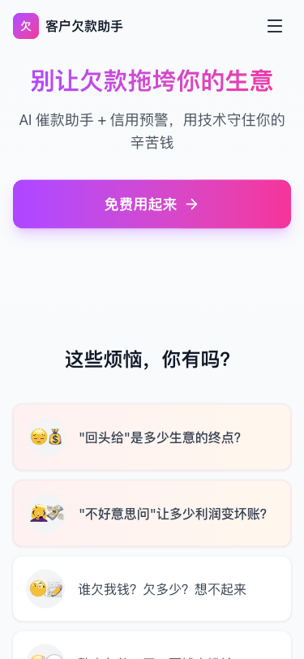

# 客户欠款助手

<div align="center">
  
</div>

<div align="center">
  <strong>简单高效的客户欠款管理工具</strong>
</div>

<div align="center">
  帮助小店主、批发商轻松管理客户欠款和还款记录，支持AI智能催款
</div>

---

## 📱 应用场景

适用于各类需要管理客户欠款的场景：

- 🏪 **小店主** - 管理熟客欠款，到期自动提醒
- 📦 **批发商** - 管理多个客户的赊账记录
- 🛒 **零售店主** - 记录日常欠款还款流水
- 🍎 **水果摊主** - 管理固定客户的账期

## ✨ 核心功能

### 👥 客户管理
- 新增客户，设置信用额度和账期
- 查看客户列表，快速搜索定位
- 实时显示客户欠款状态和逾期情况

### 💰 欠款录入
- 快速记录客户欠款，支持备注说明
- 自动计算到期日期，智能提醒
- 超出信用额度时自动预警

### 💵 还款记录
- 记录客户还款，支持多种还款方式备注
- 实时更新欠款余额
- 清晰的收支流水展示

### ⏰ 逾期提醒
- 自动识别逾期欠款
- 首页醒目展示逾期金额
- 支持筛选查看逾期客户

### 🤖 AI智能催款
- 一键生成催款文案
- 多种风格可选（温和/正式/幽默）
- 复制后可直接粘贴到微信发送

## 🛠 技术栈

| 技术 | 说明 |
|------|------|
| React 18 | 前端框架 |
| TypeScript | 类型安全 |
| Vite | 构建工具 |
| Tailwind CSS | 样式方案 |
| Supabase | 后端服务（数据库+认证） |
| Zustand | 状态管理 |
| Lucide React | 图标库 |
| date-fns | 日期处理 |

## 🚀 快速开始

### 环境要求
- Node.js 18+
- npm 或 yarn

### 安装运行

```bash
# 克隆项目
git clone https://github.com/your-username/qiankuandemo.git

# 进入项目目录
cd qiankuandemo

# 安装依赖
npm install

# 启动开发服务器
npm run dev

# 构建生产版本
npm run build
```

## 📖 使用指南

### 1️⃣ 注册登录
- 打开应用，点击"登录"
- 输入邮箱和密码注册/登录
- 支持邮箱验证

### 2️⃣ 添加客户
1. 点击底部导航"客户"
2. 点击右下角"+"按钮
3. 填写客户信息：
   - 客户姓名（必填）
   - 手机号（选填）
   - 信用额度（可设置无限制）
   - 固定账期（如30天）

### 3️⃣ 记录欠款
1. 点击首页右下角"+"按钮
2. 选择"欠款"类型
3. 选择客户
4. 输入金额和备注
5. 点击"确认提交"

### 4️⃣ 记录还款
1. 点击首页右下角"+"按钮
2. 选择"还款"类型
3. 选择客户
4. 输入金额和备注（如：微信转账）
5. 点击"确认提交"

### 5️⃣ AI催款
1. 在首页找到逾期客户
2. 点击"AI催款"按钮
3. 查看生成的催款文案
4. 可点击"换一种风格"切换文案
5. 点击"复制文案"，粘贴到微信发送

### 6️⃣ 查看流水
- 首页展示所有收支明细
- 点击"收支明细"查看完整流水
- 支持按日期排序

## 📸 功能演示

| 功能 | 说明 |
|------|------|
| 落地页 | 产品介绍，快速了解功能 |
| 登录 | 安全的用户认证系统 |
| 首页 | 逾期提醒、收支明细一目了然 |
| 客户管理 | 添加客户、设置额度账期 |
| 记录欠款 | 快速录入欠款信息 |
| 记录还款 | 记录还款，更新余额 |
| AI催款 | 智能生成催款文案 |

## 🔒 数据安全

- 用户数据存储在Supabase云端数据库
- 支持用户认证，数据隔离
- 支持离线使用（本地缓存）

## 📝 License

MIT License - 欢迎自由使用和修改

---

<div align="center">
  Made with ❤️ for small business owners
</div>
